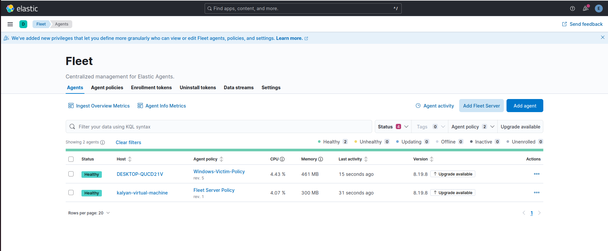
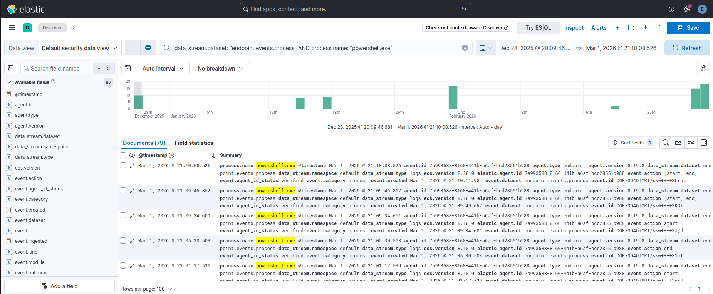
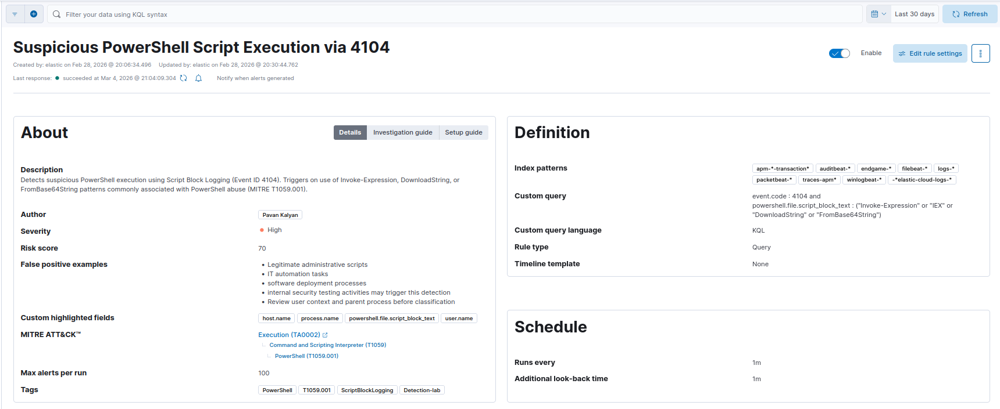
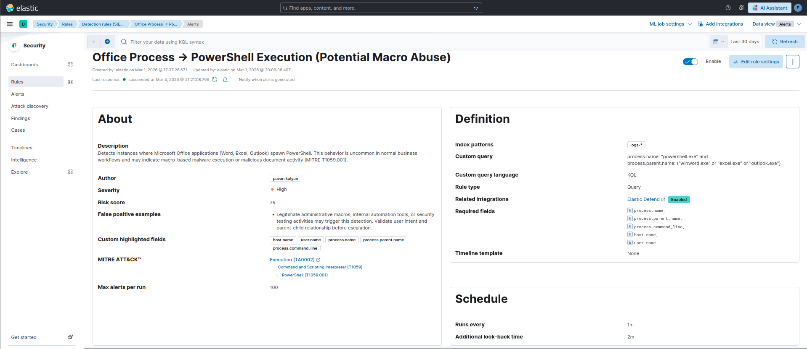
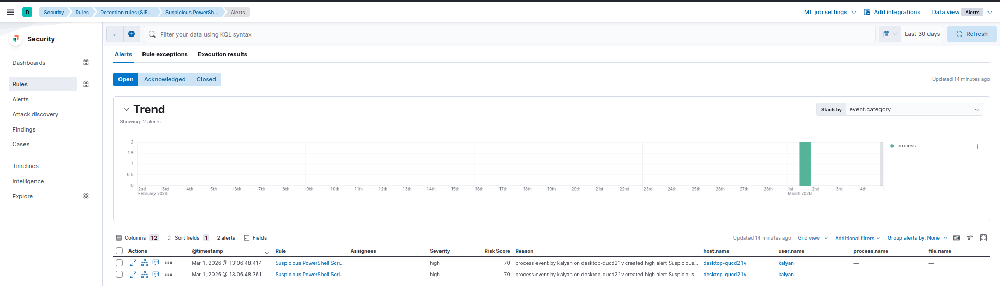
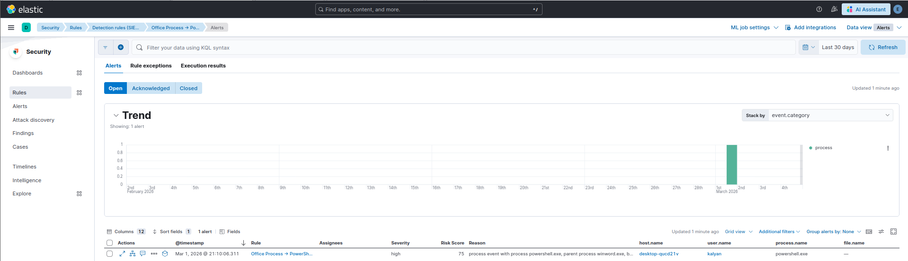

# Elastic Stack SOC Detection Engineering Lab

## SOC Detection Pipeline Architecture

---
Windows Endpoint
│
▼
Elastic Agent
│
▼
Fleet Server
│
▼
Elasticsearch
│
▼
Kibana (Detection Engine)
│
▼
Security Alerts
---

> Hands-on SOC Detection Engineering case study built using Elastic Stack.  
> Demonstrates telemetry validation, behavior-based detection development, alert debugging, dataset analysis, and infrastructure troubleshooting in a simulated enterprise environment.

## Overview

Designed and implemented an end-to-end SOC Detection Engineering lab using the Elastic Stack to simulate enterprise-grade endpoint monitoring.

The project focuses on structured telemetry validation, behavior-based detection logic, alert debugging, dataset-level analysis, and infrastructure troubleshooting.

## Technical Skills Demonstrated

- Elastic Stack (Elasticsearch, Kibana, Fleet, Elastic Defend)
- Windows Event Log Analysis
- ECS Field Validation
- Detection Rule Development
- MITRE ATT&CK Mapping
- Alert Time-Window Debugging
- Dataset Troubleshooting
- Linux Network Configuration (Netplan)

## Lab Environment

- Ubuntu Server hosting Elasticsearch, Kibana, Fleet
- Windows 10 endpoint with Elastic Agent
- Elastic Defend enabled
- Custom detection rules deployed and validated

---

## Key Engineering Achievements

- Built behavior-based detection (Office spawning PowerShell)
- Mapped detections to MITRE ATT&CK techniques
- Enabled and validated PowerShell Script Block Logging (Event ID 4104)
- Debugged time-window related false-negative alerts
- Resolved dataset misalignment (process vs library events)
- Conducted controlled detection simulation testing
- Troubleshot Ubuntu Netplan & NetworkManager conflict affecting telemetry ingestion

---

## Detection Techniques Covered

- T1059.001 – PowerShell
- T1204 – User Execution
- T1566 – Phishing
- Parent-child process analysis
- Behavior-based detection engineering

---

## Documentation Structure

Detailed documentation is available in the `documentation/` folder:

1. Project Overview  
2. Lab Architecture  
3. Telemetry Validation  
4. Logging Maturity  
5. Detection Engineering  
6. Alert Validation & Debugging  
7. Dataset Analysis  
8. Simulation & Testing  
9. Infrastructure Troubleshooting  

---

---

## Detection Lab Screenshots

### Fleet Agent Healthy

Shows successful Elastic Agent enrollment and active communication with Fleet.



---

### Telemetry Validation in Discover

Validates that endpoint telemetry is successfully ingested into Elasticsearch.



---

### Detection Rule Configuration

Behavior-based detection identifying Microsoft Office spawning PowerShell.



---

### Detection Rule Logic

Rule detecting abnormal parent-child process behavior.


---

### Alert Generation

Demonstrates successful alert triggering during simulation testing.


---

### Alert Investigation View

Alert details including host, user, and process context.

  

---

## Purpose

This project demonstrates practical detection engineering capability, including rule development, operational validation, and troubleshooting beyond standard alert monitoring.

It reflects hands-on SOC-level thinking rather than theoretical study.

## Professional Outcome

This project reflects readiness for:

- SOC Analyst (L1) roles
- Security Monitoring roles
- Entry-level Detection Engineering exposure

It demonstrates the ability to move beyond alert monitoring into structured detection development and troubleshooting.

---

## SOC Investigation Walkthrough

### Scenario

A detection rule was designed to identify suspicious behavior where Microsoft Office applications spawn PowerShell processes.

This behavior is commonly associated with:

- Malicious Office macros
- Phishing payload execution
- Initial access techniques used by adversaries

---

### Investigation Process

1. Confirmed endpoint telemetry ingestion through Fleet.
2. Verified process events in Kibana Discover.
3. Observed parent-child relationship:

   - Parent process: `WINWORD.EXE`
   - Child process: `powershell.exe`

4. Validated ECS fields:

   - `process.name`
   - `process.parent.name`
   - `event.category`

5. Confirmed dataset used by the detection rule:

Dataset
```
logs-endpoint.events.process
```

Index Pattern
```
logs-endpoint.events.*
```

6. Reviewed detection rule schedule and lookback configuration.

---

### Detection Outcome

The rule successfully triggered when PowerShell was executed from an Office process.

Alert context confirmed:

- Host
- User
- Parent process
- Child process
- Timestamp

---

### Analyst Conclusion

This behavior may indicate macro-based malware execution or malicious document activity.

Further investigation steps in a real SOC environment would include:

- Reviewing the PowerShell command line
- Inspecting script block logs (Event ID 4104)
- Checking file hashes and reputation
- Investigating user activity timeline
